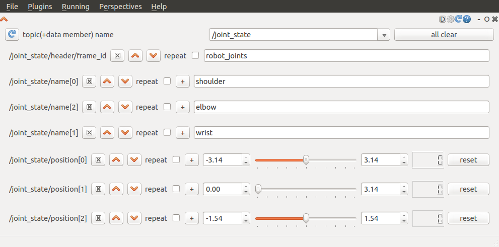
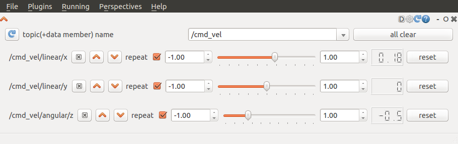
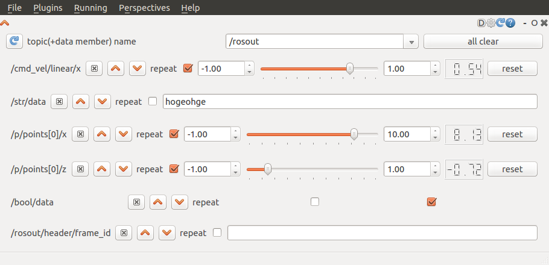

.. rqt_ez_publisher documentation master file, created by
   sphinx-quickstart on Sat Jul  5 22:29:35 2014.
   You can adapt this file completely to your liking, but it should at least
   contain the root `toctree` directive.

rqt_ez_publisher
============================================

rqt_ez_publisher is a plugin for rqt.
This creates GUI for publishing topics.
hoge

   for /joint_states (sensor_msgs/JointState)

   for /cmd_vel (goemetry_msgs/Twist)

   for everything

                             
Contents:

.. toctree::
   :maxdepth: 2

   rqt_ez_publisher
   rqt_ez_publisher.widget
   rqt_ez_publisher.publisher
   rqt_ez_publisher.quaternion_module
   changelog

Indices and tables
==================

* :ref:`genindex`
* :ref:`modindex`
* :ref:`search`

